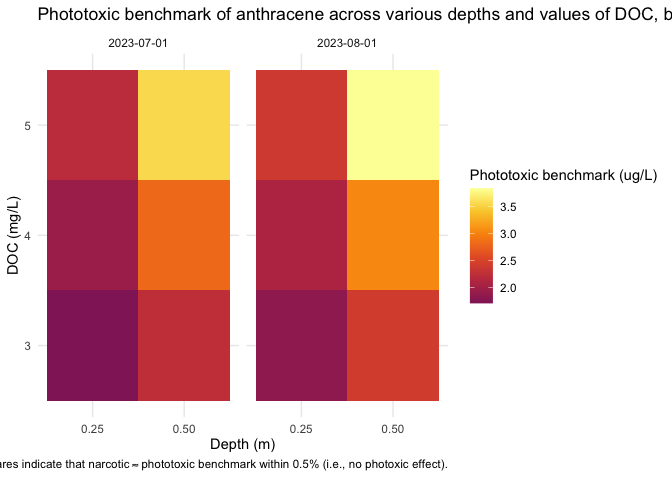
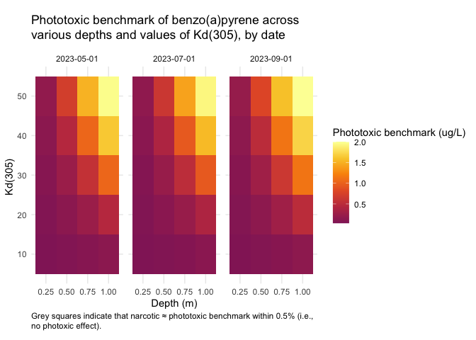

<!--
Copyright 2023 Province of British Columbia
&#10;Licensed under the Apache License, Version 2.0 (the "License");
you may not use this file except in compliance with the License.
You may obtain a copy of the License at
&#10;http://www.apache.org/licenses/LICENSE-2.0
&#10;Unless required by applicable law or agreed to in writing, software distributed under the License is distributed on an "AS IS" BASIS,
WITHOUT WARRANTIES OR CONDITIONS OF ANY KIND, either express or implied.
See the License for the specific language governing permissions and limitations under the License.
-->
<!-- README.md is generated from README.Rmd. Please edit that file -->

# pahwq

<!-- badges: start -->

[](https://github.com/bcgov/repomountie/blob/master/doc/lifecycle-badges.md)
[](https://github.com/bcgov/pahwq/actions/workflows/R-CMD-check.yaml)
[](https://app.codecov.io/gh/bcgov/pahwq?branch=main)
<!-- badges: end -->

## Overview

Implementation of the Photoxic Lipid Model (PTLM) for the calculation of
Canadian Water Quality Guidelines for Polycyclic Aromatic Hydrocarbons
(PAH).

This package uses the Tropospheric Ultraviolet and Visible (TUV)
Radiation Model (<https://github.com/NCAR/TUV>) to calculate the light
penetration through water of a given depth at a given location, with a
specified Dissolved Organic Carbon concentration. The light exposure is
then used (along with the PAH-specific molar absorption across a range
of wavelengths), to calculate the light absorption (Pabs) of the given
PAH at that location. This is then used to determine the PLC50.

## Installation

### Windows

On Windows, you need to install
[Rtools](https://cran.r-project.org/bin/windows/Rtools/). Make sure that
you install the appropriate version for your version of R (i.e. Rtools
4.0 for R 4.0.x, Rtools 4.3 for R 4.3.x, etc.). This will install a
compiler toolchain on your computer (specifically `gfortran`) which is
necessary to compile the Fortran code for the TUV model.

### Mac

On a Mac, the easiest way to get started is to use
[Homebrew](https://brew.sh/), and install `gcc`, which includes
`gfortran`:

    brew install gcc

### Install pahwq

Once you have Rtools (Windows) or `gcc` (Mac), you can install the
package with:

``` r
# install.packages("pak")
pak::pak("bcgov/pahwq")
```

*Note: You may get some warnings when you install the package - these
are from the Fortran compiler because the Fortran code is quite old and
does not fully conform to modern standards. These warnings do not affect
the package functionality or accuracy.*

## Example usage

To calculate the acute phototoxic water quality guideline (PLC50) for
Anthracene at 0.25 m depth in Okanagan Lake on June 21, 2023, with a
measured DOC of 5 g/m^3, you can use the following code:

1.  Load the pahwq package:

``` r
library(pahwq)
```

2.  Run the TUV model at your location to determine the incident light
    intensity across the wavelength spectrum, at each time stamp within
    the time window specified:

``` r
irrad <- tuv(
  depth_m = 0.25,
  lat = 49.601632,
  lon = -119.605862,
  DOC = 5,
  date = "2023-06-21",
  tzone = -8L
)
head(irrad)
#>    wl wavelength_start wavelength_end Kd_lambda t_00.00.00 t_01.00.00
#> 1 280            279.5          280.5      31.5          0          0
#> 2 281            280.5          281.5      31.0          0          0
#> 3 282            281.5          282.5      30.4          0          0
#> 4 283            282.5          283.5      29.9          0          0
#> 5 284            283.5          284.5      29.3          0          0
#> 6 285            284.5          285.5      28.8          0          0
#>   t_02.00.00 t_03.00.00 t_04.00.00 t_05.00.00 t_06.00.00 t_07.00.00 t_08.00.00
#> 1          0          0   3.17e-38   1.00e-37   1.90e-37   4.44e-37   7.97e-34
#> 2          0          0   3.22e-35   1.02e-34   1.94e-34   4.63e-34   6.16e-31
#> 3          0          0   3.75e-32   1.18e-31   2.27e-31   5.57e-31   5.40e-28
#> 4          0          0   1.84e-30   5.81e-30   1.12e-29   2.80e-29   2.26e-26
#> 5          0          0   2.20e-28   6.93e-28   1.35e-27   3.47e-27   2.17e-24
#> 6          0          0   1.75e-26   5.52e-26   1.09e-25   2.90e-25   1.37e-22
#>   t_09.00.00 t_10.00.00 t_11.00.00 t_12.00.00 t_13.00.00 t_14.00.00 t_15.00.00
#> 1   3.54e-29   2.17e-26   6.85e-25   2.05e-24   6.97e-25   2.26e-26   3.79e-29
#> 2   1.04e-26   3.66e-24   8.58e-23   2.34e-22   8.73e-23   3.79e-24   1.11e-26
#> 3   3.42e-24   6.75e-22   1.17e-20   2.91e-20   1.19e-20   6.98e-22   3.62e-24
#> 4   8.17e-23   1.16e-20   1.69e-19   3.97e-19   1.72e-19   1.20e-20   8.62e-23
#> 5   3.72e-21   3.41e-19   3.95e-18   8.63e-18   4.01e-18   3.51e-19   3.90e-21
#> 6   1.08e-19   6.34e-18   5.79e-17   1.17e-16   5.86e-17   6.50e-18   1.13e-19
#>   t_16.00.00 t_17.00.00 t_18.00.00 t_19.00.00 t_20.00.00 t_21.00.00 t_22.00.00
#> 1   8.94e-34   4.49e-37   1.91e-37   1.01e-37   3.22e-38          0          0
#> 2   6.84e-31   4.69e-34   1.95e-34   1.02e-34   3.28e-35          0          0
#> 3   5.93e-28   5.64e-31   2.29e-31   1.19e-31   3.81e-32          0          0
#> 4   2.46e-26   2.83e-29   1.13e-29   5.84e-30   1.87e-30          0          0
#> 5   2.35e-24   3.51e-27   1.36e-27   6.97e-28   2.24e-28          0          0
#> 6   1.47e-22   2.94e-25   1.10e-25   5.56e-26   1.78e-26          0          0
#>   t_23.00.00
#> 1          0
#> 2          0
#> 3          0
#> 4          0
#> 5          0
#> 6          0
```

3.  Calculate the value of P<sub>abs</sub> for the PAH of interest,
    using the results of the TUV model run:

``` r
(Pabs <- p_abs(irrad, "Anthracene"))
#> [1] 451.0696
```

4.  Finally, calculate the PLC50 for the PAH of interest

``` r
plc50(Pabs, pah = "Anthracene")
#> [1] 2.128409
```

We can compare the PLC50 to the NLC50 to see the effect of the
photoxicity of the PAH:

``` r
nlc50("Anthracene")
#> [1] 58.40685
```

### Options

pahwq creates a directory on your computer to store the TUV model input
and output files. By default, the location of this is set automatically
to a standard location (determined by `tools::R_user_dir`). You can
change the location of this directory by setting the
`pahwq.tuv_data_dir` option:

``` r
options("pahwq.tuv_data_dir" = "path/to/my/tuv/data")
```

### Running the TUV model step-by-step

Step 2 above can be broken down if you desire to inspect each phase of
running the TUV model:

1.  Set the options for the TUV model run:

``` r
set_tuv_aq_params(
  depth_m = 0.25,
  lat = 49.601632,
  lon = -119.605862,
  DOC = 5,
  date = "2023-06-21",
  tzone = -8L
)
```

2.  Run the TUV model

``` r
run_tuv()
```

3.  Get the results of the TUV model run, as a data.frame of incident
    irradiation at each timestamp and wavelength, at the given water
    depth at your location:

``` r
irrad <- get_tuv_results(file = "out_irrad_y")
head(irrad)
#>    wl wavelength_start wavelength_end Kd_lambda t_00.00.00 t_01.00.00
#> 1 280            279.5          280.5      31.5          0          0
#> 2 281            280.5          281.5      31.0          0          0
#> 3 282            281.5          282.5      30.4          0          0
#> 4 283            282.5          283.5      29.9          0          0
#> 5 284            283.5          284.5      29.3          0          0
#> 6 285            284.5          285.5      28.8          0          0
#>   t_02.00.00 t_03.00.00 t_04.00.00 t_05.00.00 t_06.00.00 t_07.00.00 t_08.00.00
#> 1          0          0   3.17e-38   1.00e-37   1.90e-37   4.44e-37   7.97e-34
#> 2          0          0   3.22e-35   1.02e-34   1.94e-34   4.63e-34   6.16e-31
#> 3          0          0   3.75e-32   1.18e-31   2.27e-31   5.57e-31   5.40e-28
#> 4          0          0   1.84e-30   5.81e-30   1.12e-29   2.80e-29   2.26e-26
#> 5          0          0   2.20e-28   6.93e-28   1.35e-27   3.47e-27   2.17e-24
#> 6          0          0   1.75e-26   5.52e-26   1.09e-25   2.90e-25   1.37e-22
#>   t_09.00.00 t_10.00.00 t_11.00.00 t_12.00.00 t_13.00.00 t_14.00.00 t_15.00.00
#> 1   3.54e-29   2.17e-26   6.85e-25   2.05e-24   6.97e-25   2.26e-26   3.79e-29
#> 2   1.04e-26   3.66e-24   8.58e-23   2.34e-22   8.73e-23   3.79e-24   1.11e-26
#> 3   3.42e-24   6.75e-22   1.17e-20   2.91e-20   1.19e-20   6.98e-22   3.62e-24
#> 4   8.17e-23   1.16e-20   1.69e-19   3.97e-19   1.72e-19   1.20e-20   8.62e-23
#> 5   3.72e-21   3.41e-19   3.95e-18   8.63e-18   4.01e-18   3.51e-19   3.90e-21
#> 6   1.08e-19   6.34e-18   5.79e-17   1.17e-16   5.86e-17   6.50e-18   1.13e-19
#>   t_16.00.00 t_17.00.00 t_18.00.00 t_19.00.00 t_20.00.00 t_21.00.00 t_22.00.00
#> 1   8.94e-34   4.49e-37   1.91e-37   1.01e-37   3.22e-38          0          0
#> 2   6.84e-31   4.69e-34   1.95e-34   1.02e-34   3.28e-35          0          0
#> 3   5.93e-28   5.64e-31   2.29e-31   1.19e-31   3.81e-32          0          0
#> 4   2.46e-26   2.83e-29   1.13e-29   5.84e-30   1.87e-30          0          0
#> 5   2.35e-24   3.51e-27   1.36e-27   6.97e-28   2.24e-28          0          0
#> 6   1.47e-22   2.94e-25   1.10e-25   5.56e-26   1.78e-26          0          0
#>   t_23.00.00
#> 1          0
#> 2          0
#> 3          0
#> 4          0
#> 5          0
#> 6          0
```

### Calculating photoxicity for multiple chemicals

If you want to calculate PLC50 for several chemicals at a particular
site, you can use the `plc50_multi()` function.

First, you must calculate the absorption with `tuv()`:

``` r
irrad <- tuv(
  depth_m = 0.25,
  lat = 49.601632,
  lon = -119.605862,
  DOC = 5,
  date = "2023-06-21",
  tzone = -8L,
  quiet = TRUE
)
```

Then, use the results from the TUV model run and a vector of chemical
names:

``` r
plc50_multi(irrad, pahs = c("Anthracene", "Benzo(a)pyrene", "Fluorene"))
#>              pah      nlc50         pabs       plc50
#> 1     anthracene  58.406846 4.510696e+02  2.12840933
#> 2 benzo(a)pyrene   1.832461 2.336815e+03  0.03375568
#> 3       fluorene 111.266961 2.201839e-02 80.32970027
```

### Sensitivity to Kd, depth, and time of year

Use the function `sens_kd_depth()` to investigate the sensitivity of a
given PAH at a location to light attenuation (`DOC` or `Kd`) and depth
over a set of dates.

There is also a plotting function, `plot_sens_kd_depth()` to make a
static or interactive heat map of the analysis.

``` r
# varying DOC
out <- sens_kd_depth(
  "Anthracene",
  lat = 52,
  lon = -113,
  DOC = 3:5,
  depth_m = c(0.25, 0.5),
  date = c("2023-07-01", "2023-08-01")
)
head(out)
#> # A tibble: 6 × 11
#>     lat   lon elev_m depth_m date         DOC tuv_res    pah   nlc50  pabs plc50
#>   <dbl> <dbl>  <dbl>   <dbl> <date>     <int> <list>     <chr> <dbl> <dbl> <dbl>
#> 1    52  -113    880    0.25 2023-07-01     3 <tv_rslts> anth…  58.4 1068.  1.49
#> 2    52  -113    880    0.5  2023-07-01     3 <tv_rslts> anth…  58.4  370.  2.31
#> 3    52  -113    880    0.25 2023-08-01     3 <tv_rslts> anth…  58.4  912.  1.59
#> 4    52  -113    880    0.5  2023-08-01     3 <tv_rslts> anth…  58.4  313.  2.47
#> 5    52  -113    880    0.25 2023-07-01     4 <tv_rslts> anth…  58.4  675.  1.80
#> 6    52  -113    880    0.5  2023-07-01     4 <tv_rslts> anth…  58.4  162.  3.23

plot_sens_kd_depth(out, interactive = FALSE)
```



``` r
# Varying Kd_ref
out2 <- sens_kd_depth(
  "benzo(a)pyrene",
  lat = 57,
  lon = -120,
  Kd_ref = seq(10, 50, by = 10),
  depth_m = c(0.25, 0.5, 0.75, 1),
  date = c("2023-05-01", "2023-07-01", "2023-09-01")
)

plot_sens_kd_depth(out2, interactive = FALSE)
```



## Getting Help or Reporting an Issue

To report bugs/issues/feature requests, please file an
[issue](https://github.com/bcgov/pahwq/issues/).

## How to Contribute

If you would like to contribute to the package, please see our
[CONTRIBUTING](CONTRIBUTING.md) guidelines.

Please note that this project is released with a [Contributor Code of
Conduct](CODE_OF_CONDUCT.md). By participating in this project you agree
to abide by its terms.

## License

    Copyright 2023 Province of British Columbia

    Licensed under the Apache License, Version 2.0 (the &quot;License&quot;);
    you may not use this file except in compliance with the License.
    You may obtain a copy of the License at

    http://www.apache.org/licenses/LICENSE-2.0

    Unless required by applicable law or agreed to in writing, software distributed under the License is distributed on an &quot;AS IS&quot; BASIS,
    WITHOUT WARRANTIES OR CONDITIONS OF ANY KIND, either express or implied.
    See the License for the specific language governing permissions and limitations under the License.
